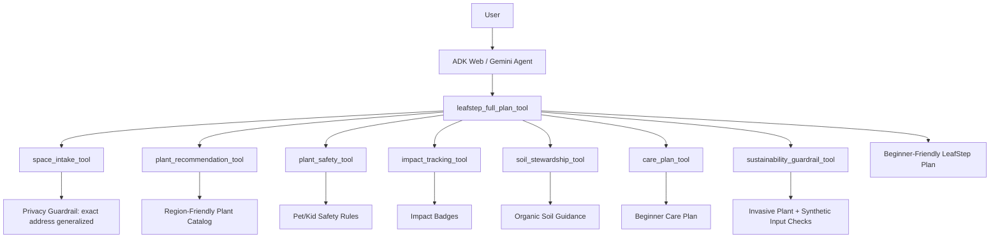

# LeafStep Agent

**LeafStep Agent** is an AI agent that helps households turn a small outdoor space into a safe, low-maintenance, pollinator-friendly microhabitat.

The project was built for the **Google x Kaggle 5-Day AI Agents: Intensive Vibe Coding Capstone**. It demonstrates how an agent can guide a beginner from vague gardening intent to a practical first action plan using structured intake, deterministic tools, safety guardrails, ADK/Gemini integration, project-scoped skills, and Cloud Run-ready deployment.

---

## Problem

Many households want to do something positive for the environment but do not know where to start.

Gardening advice can be overwhelming:

* Which plants work in my region?
* What fits a small backyard, balcony, or side strip?
* What is safe if I have pets or kids?
* What should I do in the first 30 days?
* How do I avoid invasive plants or chemical-heavy shortcuts?

LeafStep focuses on a small, realistic starting point: **one tiny household patch**.

Instead of telling users to redesign their whole yard, LeafStep helps them take one practical first step.

---

## Solution

LeafStep Agent collects a simple intake and turns it into a beginner-friendly microhabitat plan.

The agent can:

* Normalize the user's space, sunlight, safety needs, and starter size
* Recommend region-friendly plants for Oakville / Ontario-style conditions
* Apply pet/kid safety filtering
* Avoid unnecessary exact address collection
* Provide simple impact badges
* Suggest organic soil stewardship actions
* Generate a beginner care plan
* Run sustainability guardrails against invasive plants and synthetic inputs

---

## Why Agents?

LeafStep is more than a static plant list.

An agent is useful here because the user's needs are contextual:

* A backyard is different from a balcony
* Full sun is different from shade
* A dog/kid household needs extra safety checks
* A beginner needs a simpler plan than an experienced gardener
* A privacy-aware assistant should not require an exact home address

LeafStep uses tools to break the workflow into reliable steps instead of asking the LLM to invent everything from scratch.

The latest ADK/Gemini demo uses a **single LLM-facing wrapper tool**, `leafstep_full_plan_tool`, while the safety-critical workflow still runs through deterministic Python tools underneath.

This design keeps the LLM-facing schema simple, reduces token usage, avoids malformed nested function calls, and keeps privacy, safety, and sustainability checks testable.

---

## Architecture



### ADK Web Demo Design

For the ADK/Gemini web demo, LeafStep exposes one demo-safe wrapper tool: `leafstep_full_plan_tool`.

This wrapper accepts simple string inputs from Gemini, then runs the full deterministic LeafStep workflow internally:

1. Intake normalization
2. Privacy/address generalization
3. Plant recommendation
4. Pet/kid safety filtering
5. Impact tracking
6. Soil stewardship guidance
7. Care planning
8. Sustainability guardrail checking

This prevents the LLM from having to pass complex nested plant objects between tools. Gemini handles the user-facing reasoning and summary, while Python controls the safety-critical workflow.

---

## Core Tools

### `leafstep_full_plan_tool`

This is the main ADK/Gemini-facing tool for the web demo.

It accepts simple string inputs:

* Location
* Space type
* Sunlight
* Garden style
* Safety mode
* Starter size

Then it orchestrates the complete LeafStep workflow internally using the deterministic tools below.

### `space_intake_tool`

Normalizes the setup:

* Location
* Space type
* Sunlight
* Garden style
* Safety mode
* Starter size

It also includes a privacy guardrail. If a user enters an exact-address-looking location, LeafStep generalizes it to a city/region.

Example:

```text
Input: 123 Maple Street, Oakville
Output region: Oakville
privacy_status: generalize_location
```

### `plant_recommendation_tool`

Recommends plants based on:

* Region
* Space type
* Sunlight
* Garden style
* Starter size

### `plant_safety_tool`

Applies pet/kid safety rules and returns:

* Safe buy list
* Careful placement list
* Do-not-buy list

### `impact_tracking_tool`

Creates simple impact badges:

* Pollinator support
* Water need
* Maintenance
* Native fit
* Biodiversity value
* Tracking action

### `soil_stewardship_tool`

Provides organic soil preparation guidance, including compost, mulch, and low-disturbance soil practices.

### `care_plan_tool`

Creates a beginner-friendly care plan.

### `sustainability_guardrail_tool`

Checks proposed plants and inputs against ecological safety rules.

It can block:

* Invasive plants such as English ivy
* Synthetic inputs such as Roundup, glyphosate, and chemical pesticides

---

## Safety and Guardrails

LeafStep includes three practical guardrail themes.

### 1. Privacy Guardrail

LeafStep does not need a user's exact home address.

If a user enters something like:

```text
123 Maple Street, Oakville
```

the tool generalizes the location to:

```text
Oakville
```

and returns a privacy note.

### 2. Household Safety Guardrail

If the user has pets or kids, LeafStep applies safety filtering.

It separates plants into:

* Safe picks
* Careful placement options
* Do-not-buy plants

### 3. Sustainability Guardrail

LeafStep checks against invasive plants and synthetic chemical inputs.

This keeps the agent aligned with the project goal: helping users create small ecological improvements without causing accidental harm.

---

## Course Concepts Demonstrated

This project demonstrates multiple concepts from the Google/Kaggle AI Agents course.

| Concept                | Where it appears                                                                                                                                                          |
| ---------------------- | ------------------------------------------------------------------------------------------------------------------------------------------------------------------------- |
| ADK agent              | `app/agent.py`                                                                                                                                                            |
| Gemini / real LLM demo | `adk web`, `run_agent_demo.py`, `llm_main.py`                                                                                                                             |
| Tool orchestration     | `leafstep_full_plan_tool` orchestrates deterministic tools in `app/tools.py`                                                                                              |
| Deterministic tools    | `space_intake_tool`, `plant_recommendation_tool`, `plant_safety_tool`, `impact_tracking_tool`, `soil_stewardship_tool`, `care_plan_tool`, `sustainability_guardrail_tool` |
| Guardrails / safety    | Privacy generalization, pet/kid safety, sustainability checks                                                                                                             |
| Token efficiency       | One LLM-facing wrapper tool instead of exposing many nested tool schemas                                                                                                  |
| Agents CLI skills      | `.agents/skills/`                                                                                                                                                         |
| Deployability          | `Dockerfile`, `main.py`, `llm_main.py`, `requirements-cloudrun.txt`                                                                                                       |
| Testing                | `tests/unit/test_tools.py`                                                                                                                                                |

---

## Agents CLI Skills

LeafStep uses project-scoped skills as development-time quality gates.

### `leafstep-code-review`

Checks:

* ADK structure
* Tool orchestration
* Guardrail usage
* Tests
* README quality
* Token efficiency
* Secret safety

### `leafstep-submission-review`

Checks:

* Kaggle writeup clarity
* Demo strength
* Architecture explanation
* ADK/Gemini usage
* Skills usage
* Sustainability impact
* Safety guardrails
* Limitations

These skills do not run inside the user-facing product. They support repeatable review workflows while building and preparing the capstone submission.

---

## Demo Options

LeafStep has three demo paths.

### 1. Local deterministic demo

This runs the no-LLM version of the workflow.

```bash
uv run python demo.py
```

Use this when you want a predictable local demo without Gemini credentials.

### 2. Local ADK/Gemini web demo

This runs the ADK web interface locally and uses the Gemini-powered LeafStep agent.

Set your Gemini API key first:

```bash
export GEMINI_API_KEY="your_api_key_here"
export GOOGLE_GENAI_USE_VERTEXAI=FALSE
export GOOGLE_GENAI_USE_ENTERPRISE=FALSE
```

Then run:

```bash
uv run adk web
```

Recommended short demo prompt:

```text
Plan a small Oakville backyard LeafStep: part sun, flowers, pets and kids. Include plants, safety, soil, care, impact, and sustainability.
```

The ADK web demo should call:

```text
leafstep_full_plan_tool
```

and return a beginner-friendly LeafStep plan.

### 3. Real ADK/Gemini trace demo

This runs a real ADK/Gemini tool-calling trace and then a deterministic full tool-chain demo.

Set your Gemini API key first:

```bash
export GEMINI_API_KEY="your_api_key_here"
export GOOGLE_GENAI_USE_VERTEXAI=FALSE
export GOOGLE_GENAI_USE_ENTERPRISE=FALSE
```

Then run:

```bash
uv run python run_agent_demo.py
```

This demo can show:

* ADK/Gemini agent behavior
* Privacy guardrail
* Plant recommendations
* Pet/kid safety filtering
* Impact badges
* Soil guidance
* Care plan
* Sustainability guardrail

If Gemini is temporarily unavailable or overloaded, the deterministic full tool-chain section still demonstrates the complete LeafStep workflow.

---

## Setup

### 1. Clone the repo

```bash
git clone https://github.com/apoorvadeoai/leafstep-agent.git
cd leafstep-agent
```

### 2. Install dependencies

```bash
uv sync
```

### 3. Run formatting and lint checks

```bash
uv run ruff format .
uv run ruff check . --fix
```

### 4. Run unit tests

```bash
uv run pytest tests/unit
```

### 5. Run local deterministic demo

```bash
uv run python demo.py
```

### 6. Run ADK/Gemini web demo

```bash
export GEMINI_API_KEY="your_api_key_here"
export GOOGLE_GENAI_USE_VERTEXAI=FALSE
export GOOGLE_GENAI_USE_ENTERPRISE=FALSE
uv run adk web
```

### 7. Run ADK/Gemini trace demo

```bash
export GEMINI_API_KEY="your_api_key_here"
export GOOGLE_GENAI_USE_VERTEXAI=FALSE
export GOOGLE_GENAI_USE_ENTERPRISE=FALSE
uv run python run_agent_demo.py
```

---

## Testing

Unit tests cover:

* Exact-address privacy guardrail
* Oakville plant recommendation flow
* Pet/kid safety filtering
* Invasive plant blocking
* Synthetic input blocking
* Safe native plan pass case

Run:

```bash
uv run pytest tests/unit
```

Note: Some integration-style demos require Google credentials because they call the real ADK/Gemini agent.

---

## Example Scenario

User input:

```text
I live at 123 Maple Street, Oakville.
I have a small backyard patch with part sun.
I have two kids and a dog.
I want low-maintenance pollinator-friendly flowers.
```

LeafStep output:

* Generalizes location to Oakville
* Recommends part-sun pollinator plants
* Applies pet/kid safety filtering
* Returns simple impact badges
* Suggests compost and mulch-based soil prep
* Creates beginner care guidance
* Runs a sustainability guardrail check

---

## Example Recommended Plants

For an Oakville backyard patch with part sun and flower preference, LeafStep may recommend:

* Wild Bergamot
* Black-eyed Susan
* New England Aster
* Purple Coneflower
* Foamflower

The final list depends on the intake profile and safety filtering.

---

## Deployment

LeafStep supports two Cloud Run deployment modes.

### 1. Stable no-LLM Cloud Run demo

This deploys the deterministic FastAPI demo from `main.py`.

```bash
gcloud run deploy leafstep-agent-demo-nollm \
  --source . \
  --region us-central1 \
  --allow-unauthenticated
```

This version is useful for a stable public demo because it does not depend on live Gemini availability.

### 2. LLM Cloud Run demo

This deploys the ADK/Gemini-facing demo from `llm_main.py`.

```bash
gcloud run deploy leafstep-agent-llm \
  --source . \
  --region us-central1 \
  --allow-unauthenticated \
  --set-env-vars APP_MODULE=llm_main:app,GOOGLE_GENAI_USE_VERTEXAI=FALSE,GOOGLE_GENAI_USE_ENTERPRISE=FALSE
```

The LLM service also needs a Gemini API key configured as an environment variable or secret:

```text
GEMINI_API_KEY=your_api_key_here
```

Do not commit API keys or secrets to the repository.

Use Cloud Run environment variables or Secret Manager for credentials.

---

## Project Structure

```text
leafstep-agent/
├── app/
│   ├── agent.py
│   ├── tools.py
│   ├── fast_api_app.py
│   └── app_utils/
├── tests/
│   ├── unit/
│   │   └── test_tools.py
│   ├── integration/
│   └── eval/
├── .agents/
│   └── skills/
│       ├── leafstep-code-review/
│       └── leafstep-submission-review/
├── docs/
│   ├── skill_usage.md
│   └── workshop_concepts.md
├── demo.py
├── run_agent_demo.py
├── main.py
├── llm_main.py
├── Dockerfile
├── requirements-cloudrun.txt
├── pyproject.toml
└── README.md
```

---

## Design Tradeoff

The ADK/Gemini demo intentionally exposes a single wrapper tool instead of seven separate LLM-facing tools.

Earlier versions exposed each tool directly to the agent. That approach showed explicit tool chaining but made the LLM responsible for passing nested plant objects between tool calls, which increased token usage and could produce malformed function calls.

The current design keeps the core workflow modular and deterministic while making the LLM interface simpler:

```text
Gemini / ADK
    ↓
leafstep_full_plan_tool
    ↓
deterministic Python tool chain
    ↓
safe beginner-friendly plan
```

This is better for demo reliability, token efficiency, and safety-critical workflows.

---

## Limitations

LeafStep is a capstone prototype.

Current limitations:

* Plant catalog is intentionally small and focused on Oakville/Ontario-style examples
* Recommendations should be verified before planting
* The agent does not replace professional horticultural, ecological, medical, or veterinary advice
* Pet/kid safety is conservative but not exhaustive
* Local nursery inventory is not currently checked
* Live Gemini behavior can depend on API availability and model load
* MCP is not included in the current version and is a possible future enhancement

---

## Future Improvements

Potential next steps:

* Add MCP server for local native plant and invasive species lookup
* Expand plant catalog with verified Ontario native species
* Add image-based plant identification
* Add local nursery availability
* Add seasonal planting windows
* Add user progress tracking
* Add before/after microhabitat logs
* Add richer Cloud Run UI for the LLM demo

---

## Capstone Positioning

**LeafStep Agent: Turning Tiny Yards into Safe Pollinator Microhabitats**

LeafStep helps beginners convert a small household green space into a low-maintenance, pet/kid-aware, pollinator-supporting patch using an ADK-powered agent, deterministic tools, practical guardrails, project-scoped skills, and Cloud Run-ready design.
